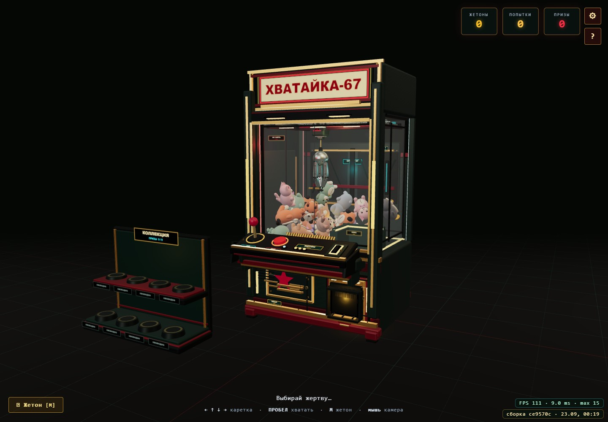
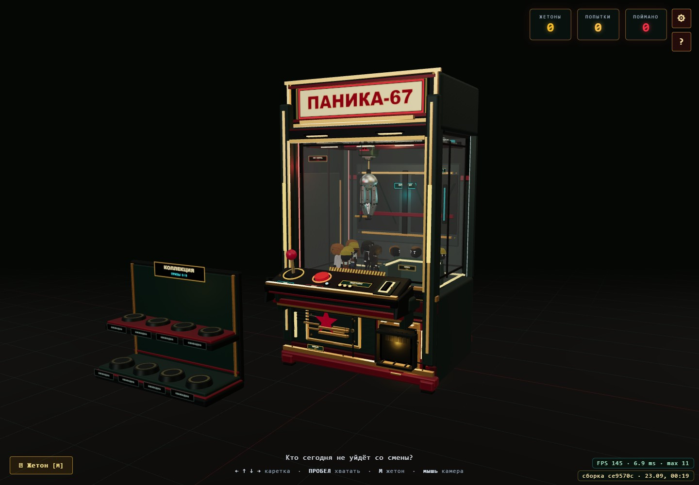
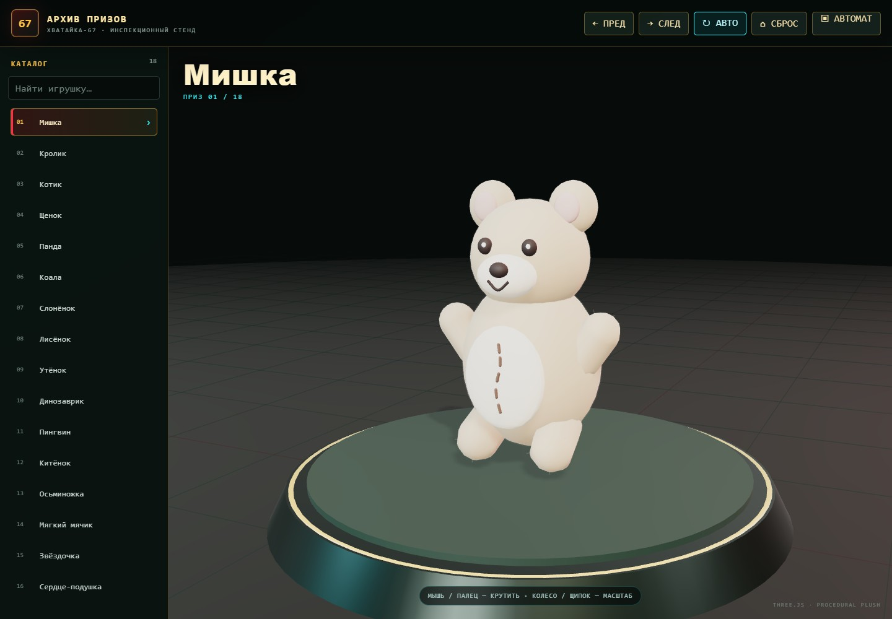

# Хватайка

Браузерный автомат с клешнёй: ретрофутуристический корпус, плюшевые игрушки и физика, из-за которой добыча выскальзывает в последний момент. Клешня висит на верёвке, раскачивается, цепляет несколько призов и несёт их к люку.

🎮 **[Играть онлайн](https://andromanpro.github.io/claw-machine/)** · [Галерея игрушек](https://andromanpro.github.io/claw-machine/toy-viewer.html) · [Скачать сборку](https://github.com/andromanpro/claw-machine/releases/latest)



> **Хват — как в жизни.** Сильный довезёт игрушку до шахты, слабый даст ей выскользнуть по дороге. Можно схватить сразу три, но сила поделится между ними. Выданный приз можно взять мышью, бросить на пол или поставить на полку своей коллекции.

## Паника в цехе

Второй режим включается в настройках. Вместо игрушек в витрине десять мультяшных сотрудников: они гуляют, замечают клешню, разбегаются и прячутся. Пойманный персонаж проходит через люк выдачи, бегает по залу, а затем сам забирается на коллекционный стенд.



## Как играть

1. Нажми Enter, пробел или кнопку старта.
2. Стрелками или джойстиком на корпусе наведи клешню на игрушку.
3. Нажми **пробел** или красную кнопку: клешня опустится, схватит добычу и попробует донести её до выдачи.
4. Перетащи полученный приз на стенд слева. Коллекция сохранится в браузере.

Жетоны виртуальные и добавляются клавишей **M**. В настройках есть бесплатная игра, щедрость хвата и пополнение игрушек. Покупок и денежных ставок нет.

| Управление | Действие |
|---|---|
| Стрелки | Перемещать каретку |
| Пробел | Опустить клешню |
| M | Добавить жетон |
| Джойстик и красная кнопка на корпусе | Управление мышью |
| Мышь / колесо | Повернуть и приблизить камеру |
| Перетаскивание приза | Взять игрушку и поставить на полку |
| Esc / кнопка настроек | Режим, звук, графика, параметры хвата |
| ? | Короткая справка |
| Экранный пульт | Управление на телефоне, включая диагонали |
| Геймпад | Левый стик и кнопка A |

## Игрушки и коллекция

- **18 процедурных игрушек:** мишки, кролики, осьминожки, коты, щенки, панды и другие призы. У моделей есть швы, банты и собственные силуэты.
- **Редкие призы:** золотой и гигантский мишки, особое свечение и фанфары.
- **Стенд на восемь мест:** два яруса, подсветка свободной полки, ручная перестановка и автоматическое размещение оставленного приза.
- **Сохранение в браузере:** отдельные коллекции для игрушек и сотрудников.
- **Победная камера:** сопровождает приз через люк; сцену можно пропустить.
- **Русский и английский интерфейс**, громкость, графические режимы и настройка управления.

Каждую игрушку можно рассмотреть отдельно в [галерее](https://andromanpro.github.io/claw-machine/toy-viewer.html): вращение мышью или пальцем, масштабирование, стрелки для переключения, R для сброса ракурса.



## Локальный запуск

Нужен **Node.js 24 LTS** и современный браузер с WebGL 2. Совместимый минимум Node.js — 22.12.

```bash
npm ci
npm run dev
```

Игра: [localhost:5273](http://localhost:5273/). Галерея: [localhost:5273/toy-viewer.html](http://localhost:5273/toy-viewer.html).

```bash
npm run build
npm run preview
```

Готовая сборка лежит в `dist/`; её можно разместить на любом статическом HTTP-хостинге, в том числе в подкаталоге. Через двойной клик по HTML модули и модели не загружаются корректно. ZIP со сборкой есть в [Releases](https://github.com/andromanpro/claw-machine/releases).

## Проверки и разработка

```bash
npm test                     # модели, production-сборка и браузерная проверка
npm audit                    # известные уязвимости зависимостей
npm run build-fugitives       # преобразование исходных FBX в игровые GLB
npm run fugitive-models-test  # скелеты, веса вершин и привязка анимаций
node tools/promo-shots.mjs    # скриншоты для README
```

Для браузерных тестов нужен установленный Chrome, Chromium или Edge. Путь можно указать через переменную окружения `CHROME_PATH`. Основной `npm test` сам поднимает серверы для проверок; порты 5273 и 5274 должны быть свободны.

Для дополнительных игровых тестов сначала запусти `npm run dev` в отдельном терминале:

```bash
npm run fugitive-test     # поведение и захват сотрудников
npm run prize-stand-test  # полки и сохранение коллекции
npm run prize-touch-test # перетаскивание пальцем
npm run mobile-test       # экранный пульт
npm run stress-test       # длительные физические сценарии
```

Проверки выполняются локально перед публикацией. Workflow GitHub Actions оставлен для ручного запуска; автоматический запуск при изменении репозитория отключён.

## Как устроено

Three.js отвечает за сцену и графику, cannon-es — за физику. Верёвка состоит из связанных физических тел; игрушка удерживается ограниченным по силе захватом и может выскользнуть. Звук синтезируется через WebAudio.

`src/claw.js` — клешня, `src/toys.js` — игрушки и выдача, `src/fugitives.js` — поведение сотрудников, `src/prize-stand.js` — коллекция, `src/prize-drag.js` — перенос призов. Исходные модели сотрудников лежат в `assets-src/`, оптимизированные GLB — в `public/models/`.

## Лицензия

Собственный код и графика — [MIT](LICENSE). Персонажи и анимации [Quaternius](https://quaternius.com/packs/ultimatedanimatedcharacter.html) — **CC0**, исходные лицензии сохранены. Подробности — в [ASSETS.md](ASSETS.md).

## Автор

Сделал **[Androman](https://androman.pro)**.

🌐 [androman.pro](https://androman.pro) · ✈ [Telegram](https://t.me/andromanpro1c) · [GitHub @andromanpro](https://github.com/andromanpro)
